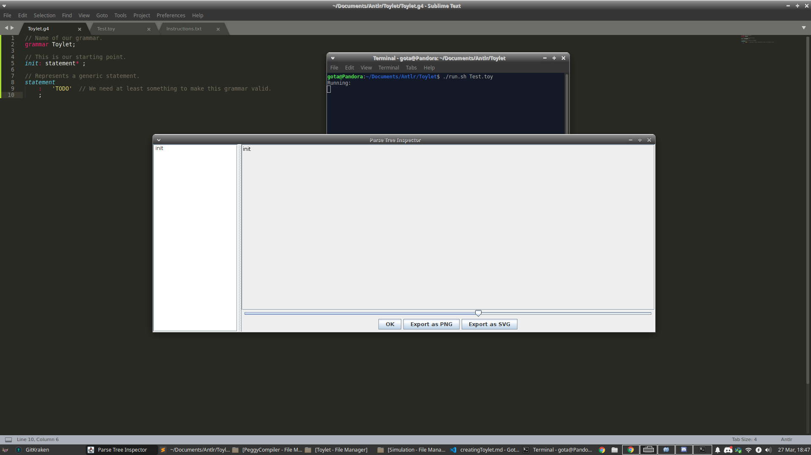
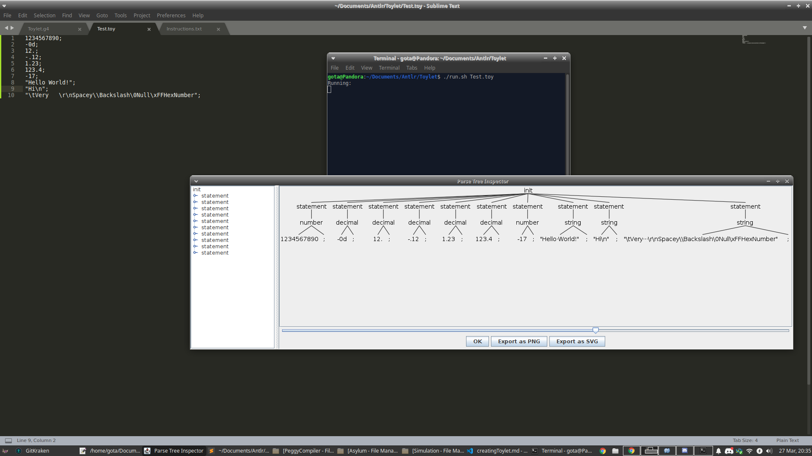
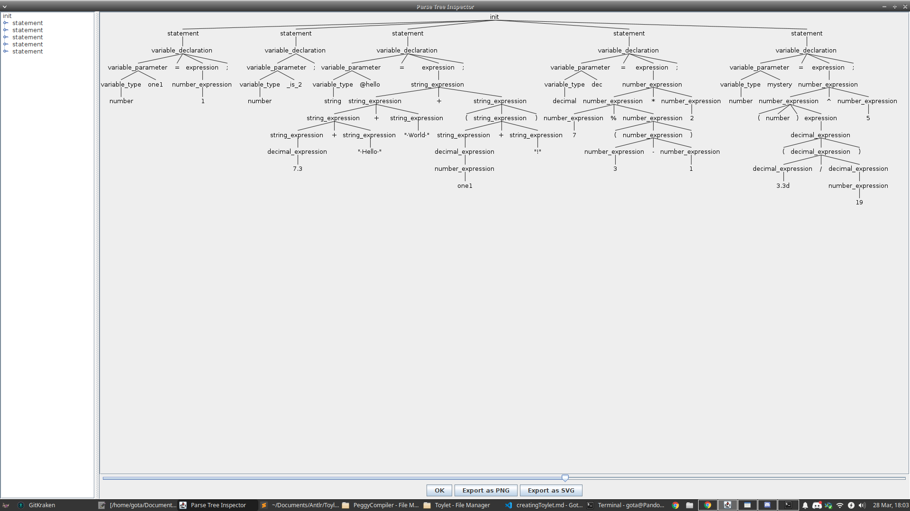
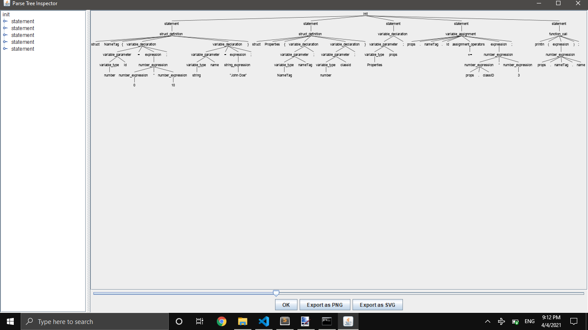

# How To Make A Programming Language
Ever wanted to create your own programming language?

## Table Of Contents
* [Index](Index.md)
* [ANTLR4 Setup](AntlrSetup.md)
* [ANTLR4 Grammar](Grammar.md)
* [Creating Toylet](CreatingToylet.md) <- You are here.
* [Project Setup](ProjectSetup.md)
* [LLVM Crashcourse](Llvm.md)
* [Compiling Toylet](CompilingToylet.md)
* [Epilogue](Epilogue.md)

## Introduction
Hello, this is Gota7. Before we have been doing some setup and some learning, but now it is time to actually do the work. Well, I sure hope you did the setup and learning in the previous pages. If not, slap yourself in the face and go read them now, not skim them, read and understand them as it will help you here. It will benefit you to try and practice making a simple language with me first in order to make something more complicated in the end. For your sake, there will be no final code for you to copy paste. :}

## So Uh, How Do We Begin?
Great question! Let's first take a look at some sample Toylet code from earier:
```cs
func doThing(number num, string str, decimal dec) {
    number a = num + 5 * 3 - 1;
    a += (number)dec;
    println(str + a);
}

doThing(3, "Result: ", 5.7);
```
As you can see, there are a lot of moving parts here. But before we can even *think* about implementing anything, we have to get a basic grammar that runs at the very least. Put the following in `Toylet.g4`:
```cs
// Name of our grammar.
grammar Toylet;

// This is our starting point.
init: statement* ;

// Represents a generic statement.
statement
    :   'TODO'  // We need at least something to make this grammar valid.
    ;
```
Now make sure `Test.toy` is blank. Simply run the `run` script with either `Test.toy` as a parameter, or with no parameters and hitting `Ctrl+D` after it starts (normally you enter text you want to test before hitting `Ctrl+D`, but we have none in this case). When ever I say to *run* an input, this is what you will be doing. There will be no more grammar files except for `Toylet.g4`, but you can have as many test `.toy` files as you wish. If you want your folder to be cleared from the garbage ANTLR makes, run the `clean` script. Anyways, you should see this output:



I mean what did you expect? We didn't give it any input, or any true rules. Just the bare minimum required in order to get the language running.

## Baby's First Step
Whitespace is stupid, we don't like it in Toylet. It will interfere with interpretting, and is not needed as we use brackets and semicolons. Your first assignment is to make a `WHITESPACE` Token that uses `-> skip` to skip over whitespace. Can you also figure out how to implement C style `//` and `/* */` comments (`LINE_COMMENT` and `COMMENT` respectively)? Hints: `.` will act like a character in ANTLR that will match anything, you can use operators on it too. You also have to make sure a comment takes precedence over whitespace (as it has a newline in it), remember how to make something match first over another thing? Also note that `\r` is used sometimes, but not always. `~` followed by a character will treat that character as a noninclusive ending point.

### Test Bench
Go ahead and run the below input into your grammar (either by putting it in a `.toy` file to use as a parameter for the run script, or by entering it in manually after doing the run script with no parameters and hitting `Ctrl+D`).
```cs
// Hello World!
/*
	Nothing!
*/
```
If you test some properly formatted comment inputs such as above, you should get absolutely nothing! There should be no warnings or errors if you did it right.

### Solution
<details>
    <summary>WHITESPACE</summary>
    WHITESPACE: (' ' | '\r' | '\n' | '\t') -> skip; // There are probably more characters in the ASCII table, but these are the basic ones.
</details>
<details>
    <summary>LINE_COMMENT</summary>
    LINE_COMMENT: '//' ~('\r' | '\n') -> skip; // This ends a comment when it runs into either a newline or a carriage return.
</details>
<details>
    <summary>COMMENT</summary>
    COMMENT: '/*' .*? '*/' -> skip; // Even simpler than the other comment type, just matches anything between the multiline comment markers. A maybe operator after the any amount operator makes this non-greedy.
</details>
<details>
    <summary>Token Ordering</summary>
    While the order of LINE_COMMENT and COMMENT doesn't matter, they both should be over WHITESPACE. This is so a character belonging to WHITESPACE isn't matched by WHITESPACE before it can get to a COMMENT. All of these should be below the pre-existing Rules of course!
</details>
Now I hope you at least tried to implement them without looking at the solutions first. If you didn't try hard enough, you are cheating yourself. Hopefully you got the hang of stuff by now.

## Numbers, Decimals, And Strings, Oh My!
This is a fun challenge to see what you can do. This one will get incrementally harder. Recall that Toylet only supports 3 data types: signed numbers, decimal numbers, and strings. We need to define the following items:

* A NUMBER Token. This can be any number of digits, and is assumed to be in base 10 (decimal) by default. You can make a NUMBER base 2 (binary) by prefixing it with `0b` or `0B`, or base 16 (hexadecimal) by prefixing it with `0x` or `0X`. There still has to be a number after the prefix. A NUMBER can be negative as well by putting the `-` sign in front of it.
* A DECIMAL Token. You can have any amount of characters before the decimal point `.`, and any amount of characters after. You should not be able to just have the `.` by itself, nor should you be able to just have a number without a decimal point `.` so it would get confused with NUMBER. However, if you put a `d` or `D` after what would be a NUMBER, it will be interpretted as a DECIMAL. You can also make this negative with a `-` sign.
* A STRING Token. Any sequence of characters denoted by being inbetween a pair of `"` is a STRING. You should be able to define escape characters, such that you can insert tabs, newlines, null characters, quotes, backslashes, and even a character denoted by two backslashes, an `x` or `X`, then two hex digits (like `\x3F`).
* For now, remove the `TODO` in the `statement` Rule, and replace that Rule to be that an input can either be a `number`, `decimal`, or `string` (case is and order of them is important, figure out the correct order). Then go define those Rules to be a `NUMBER` followed by a semicolon, a `DECIMAL` followed by a semicolon, and a `STRING` followed by a semicolon respectively.

Hints: Remember that Fragments are your friends here, and you can define as many Fragments as you like. Also be sure to not use any Token definition in another Token definition. It may be helpful to define a Fragment for each of the different number bases, and a Fragments specifically for character escape sequences. Also note that `\\` is how you define a backslash in ANTLR4.

### Test Bench
Keep in mind that you can comment out lines that will not work with your grammar yet! Run the following input:
```cs
1234567890;
-0d;
12.;
-.12;
1.23;
123.4;
-17;
"Hello World!";
"Hi\n";
"\tVery   \r\nSpacey\\Backslash\0Null\xFFHexNumber";
```
You should never have any warnings or errors. Your output tree should look like this:



### Solutions
I'm warning you, you are cheating yourself if you are blatantly copying and pasting these. If you are stuck, go through one solution (do them in order) and see if it helps you solve the other parts. Obviously put the Rules above any Tokens or Fragments, and Tokens over any Fragments.

<details>
    <summary>statement</summary>
    // Simply just call our new decimal, number, and string Rules. You have to make sure decimal is in front of number though, so that way it will detect the d suffix.
    statement
        :   decimal
        |	number
        |	string
        ;
</details>
<details>
    <summary>decimal</summary>
    // Just reference our Token and a semicolon, not much going on here.
    decimal
	    :	DECIMAL ';'
	    ;
</details>
<details>
    <summary>number</summary>
    // Just reference our Token and a semicolon, not much going on here.
    number
	    :	NUMBER ';'
	    ;
</details>
<details>
    <summary>string</summary>
    // Just reference our Token and a semicolon, not much going on here.
    string
	    :	STRING ';'
	    ;
</details>
<details>
    <summary>Fragments For DECIMAL</summary>
    // Just define digits we are allowed to use.
    fragment DecDigit: [0-9];
</details>
<details>
    <summary>More Fragments For NUMBER</summary>
    // Just define some prefixes and other number types a NUMBER could use. Remember that a Fragment can call other ones. Make sure to put the HexDigit above the DecDigit since it uses it.
    fragment HexDigit: DecDigit | [a-f] | [A-F];
    fragment BinDigit: [0-1];
    fragment HexPrefix: '0x' | '0X';
    fragment BinPrefix: '0b' | '0B';
</details>
<details>
    <summary>Fragments For STRING</summary>
    // All the STRING needs is an escape sequence Fragment. Make sure to put this above the Fragments for digit types! Using other Fragments is allowed.
    fragment EscapeSequence
	    :	'\\r'
	    |	'\\n'
	    |	'\\t'
	    |	'\\a'
	    |	'\\b'
	    |	'\\v'
	    |	'\\\\'
	    |	'\\"'
	    |	'\\\''
	    |	'\\\\x' HexDigit HexDigit
	    ;
</details>
<details>
    <summary>NUMBER</summary>
    // You should obviously be defining these tokens above the fragments. This is pretty self-explanatory, just make sure there is at least one digit after the correct prefix, and allow the possibility for negatives.
    NUMBER
	    :	'-'? DecDigit+
	    |	'-'? HexPrefix HexDigit+
	    |	'-'? BinPrefix BinDigit+
	    ;
</details>
<details>
    <summary>DECIMAL</summary>
    // Make sure that a regular number has a suffix after it, and that any possibility can be potentially negative. The way this is defined means there has to be at least one digit before or after the decimal point. Remember that we can only use Fragments and not other Tokens.
    DECIMAL
	    :	'-'? DecDigit+ ('d' | 'D')
	    |	'-'? DecDigit+ '.' DecDigit* ('d' | 'D')?
	    |	'-'? DecDigit* '.' DecDigit+ ('d' | 'D')?
	    ;
</details>
<details>
    <summary>STRING</summary>
    // Match any amount of characters inbetween quotations. Make sure an escape sequence is matched first instead of any item. A maybe operator after the any operator makes this non-greedy.
    STRING
	    :	'"' (EscapeSequence | .)*? '"'
	    ;
</details>

Hopefully you were able to figure out a solution on your own or were close to one of my solutions. If you didn't try, shame on you. Next we will work on variables.

## Variables
At the moment, there are only 3 data types: Numbers, Decimals, and Strings. This means that you are only allowed to declare a variable belonging to one of these 3 types. In this next portion, we will define the rules for variable names, declaring variables, and assignment to them. You can delete everything in the `statement` rule, as well as the `number`, `decimal`, and `string` rules as those were only for testing.
* At the moment, the only statement type we will support is a variable declaration.
* A variable can not start with a decimal digit, but it can contain one in its name. Underscores are allowed anywhere, and you can start a name with the @ symbol, but nowhere else in the name. We will call any variable (or function name) an `IDENTIFIER` Token.
* A variable can be declared by either a data type followed by a type, a name, and a semicolon; or by a type, a name, and then an assignment operator `=` with an expression following. Do not worry about function calls just yet, just make sure to follow PEMDAS. Keep in mind that anything added with a string should concat it, and not result in a generic number expression. Any number added with a decimal will make it a decimal expression. Also keep in mind that you should be able to cast something as a number or a decimal to automatically make it into an expression of the given cast.
* Strings only support the `+` operator, while numbers and decimals support `+`, `-`, `*`, `/`. Numbers support more, such as `%`, `&`, `|`, `^`, `~`. Any expression can use parenthesis. If you do not know what one of these operators are, look up bitwise operators or operators in general. Bitwise operators have the presedence `~`, `&`, `^`, `|`, with all of them being below PEMDAS and having an individual priority, except for `~` which takes priority over EMDAS. Mod is on the same level of priority as multiply and divide.
* Create a `variable_type` rule that can be any of the 3 primitive types, and a `variable_parameter` Rule that takes a `variable_type` and an `IDENTIFIER`. This will not only be useful for our variable declaration Rule, but for functions as well.
* Make a different Rule for each of the different types of data expressions. This is due to the fact that you have different operators for say string than a decimal. And while normally you have to verify that options are valid in an expression at compile time, this allows us to know if an expression is invalid if it doesn't parse! Of course, you can't do this in most languages, but Toylet is an exception due to its limit amount of types. Even then, distinguishing between an expression of these 3 types would still be helpful and lessen work on making sure operations are valid.

Hints: You should probably define a Fragment that can represent the first character of a string, and another that can represent another character. You should also define 3 different Rules for each of the different expressions that a data type can have. Remember that operator precedence is given by what is on top. Also make sure to keep the *is a* mindset, as a number expression can be a decimal expression, and both could be in a string expression. Also keep in mind that a variable declaration could either be just declaring a variable or also defining it too.

### Test Bench
Remember that you can comment out lines that have not been implemented yet! Run the following test input:
```cs
number one1 = 1;
number _is_2;
string @hello = 7.3 + " Hello " + " World " + (one1 + "!");
decimal dec = 7 % (3 - 1) * 2; // Notice how this one is an int expression, but can still be assigned to a decimal value.
number mystery = (number)(3.3d / 19) ^ 5;
```

You should never have any warnings or errors. Your output tree should look like this:



### Solutions
If you are stuck, go through one solution (do them in order) and see if it helps you solve the other parts. Obviously put the Rules above any Tokens or Fragments, and Tokens over any Fragments. This section was probably one of the most confusing ones, but hopefully you were able to figure out most of it! Keep in mind that order matters with these, so anything that depends on another thing should be above the said thing.

<details>
    <summary>statement</summary>
    // Pretty self explanatory, given all we can do is declare a variable.
    statement
        :   variable_declaration
        ;
</details>
<details>
    <summary>variable_declaration</summary>
    // We can either just say a variable exists, or actually assign it a value.
    variable_declaration
	    :	variable_parameter OP_ASSIGN expression ';'
	    |	variable_parameter ';'
	    ;
</details>
<details>
    <summary>variable_parameter</summary>
    // When passing a parameter, we could only have a defined type and the name of it.
    variable_parameter
	    :	variable_type IDENTIFIER
	    ;
</details>
<details>
    <summary>Basic Tokens</summary>
    // Operators.
    OP_ASSIGN:		'=';
    OP_MUL:			'*';
    OP_DIV:			'/';
    OP_MOD:			'%';
    OP_ADD:			'+';
    OP_SUB:			'-';
    OP_NOT:			'~';
    OP_AND:			'&';
    OP_OR:			'|';
    OP_XOR:			'^';

    // Primitives.
    PRIMITIVE_NUMBER:	'number';
    PRIMITIVE_DECIMAL:	'decimal';
    PRIMITIVE_STRING:	'string';
</details>
<details>
    <summary>variable_type</summary>
    // A type can only be one of our 3 main types.
    variable_type
	    :	PRIMITIVE_NUMBER
	    |	PRIMITIVE_DECIMAL
	    |	PRIMITIVE_STRING
	    ;
</details>
<details>
    <summary>expression</summary>
    // Order is important here. We know one higher on this list could fit into another, so we don't want all expressions to be classified as string ones.
    expression
	    :	number_expression
	    |	decimal_expression
	    |	string_expression
	    ;
</details>
<details>
    <summary>Identifier Fragments</summary>
    // Some basic rules on how we can compose an identifier.
    fragment IdentifierStart: '@' | '_' | [a-z] | [A-Z];
    fragment IdentifierOther: '_' | [a-z] | [A-Z] | DecDigit;
</details>
<details>
    <summary>IDENTIFIER</summary>
    // An identifier for a variable or function name. Not much of interest here, should be fairly straightforward.
    IDENTIFIER
	    :	IdentifierStart IdentifierOther*
	    ;
</details>
<details>
    <summary>number_expression</summary>
    // This is the most complicated one of them all. Notice how it follows the order of operations, and that ones with equal prescedence are on the same line. Also notice how you are allowed to say a variable or number alone can make this expression. Casts are also satisfied.
    number_expression
	    :	'(' number_expression ')'
	    |	'(' PRIMITIVE_NUMBER ')' expression
	    |	OP_NOT number_expression
	    |	number_expression (OP_MUL | OP_DIV | OP_MOD) number_expression
	    |	number_expression (OP_ADD | OP_SUB) number_expression
	    |	number_expression OP_AND number_expression
	    |	number_expression OP_XOR number_expression
	    |	number_expression OP_OR number_expression
	    |	IDENTIFIER
	    |	NUMBER
	    ;
</details>
<details>
    <summary>decimal_expression</summary>
    // This is pretty close to the number expression, except for the fact that it has less operators, and can be a number expression if it needs to be.
    decimal_expression
	    :	'(' decimal_expression ')'
	    |	'(' PRIMITIVE_DECIMAL ')' expression
	    |	decimal_expression (OP_MUL | OP_DIV) decimal_expression
	    |	decimal_expression (OP_ADD | OP_SUB) decimal_expression
	    |	number_expression
	    |	IDENTIFIER
	    |	DECIMAL
	    ;
</details>
<details>
    <summary>string_expression</summary>
    // This is one of the simpler ones. You can only add. Also notice that it can be a decimal or number expression if needed, but does not use the expression Rule. This is due to the fact doing so would cause an infinite loop of whether or not to classify something as a string expression or a generic expression.
    string_expression
        :	'(' string_expression ')'
	    |	'(' PRIMITIVE_STRING ')' expression
	    |	string_expression OP_ADD string_expression
	    |	decimal_expression
	    |	number_expression
	    |	IDENTIFIER
	    |	STRING
	    ;
</details>

Yeah, this one was pretty hard. Although once you get this one done, it should hopefully get easier from here, or not. If you were able to figure this one out without too many problems, then you are doing really well. The next part is easier as it just basically extends off of what we have just established.

## Functions, Assignments, Loops, And Ifs
Now luckily stuff gets a little less tricky here, as we have the fundamental building blocks. Here is where we will be able to include function definitions and function calls. We will also start work on conditional statements, where any number but 0 is true, with 1 being the default true value.

* A `function_definition` always starts with `func`, followed by an `IDENTIFIER` for the name of it. Then, there is a set of parenthesis `(` `)` with any number of arguments inside, each declared by a type and an `IDENTIFIER`. A function can optionally return a value by having `->` followed by a type after the parenthesis. After all of these, there is a set of curly brackets `{` `}` which have any number of code statements inside of them. Of course this means we need to be able to `return` a value.
* An `assignment` is a `statement` that has an `IDENTIFIER`, an `assignment_operator`, and then an `expression` followed by a semicolon `;`. Expressions are allowed to call a function, which can have any number of `expression`s in the parameters. We also need to define operators such as `++` and `--`, `?` with `:`, and make the `expression` rule such it can use `comparison_operators` or the `!` token. Also add the `false` and `true` keywords.
* If statements that work like traditional if statements in the C languages, they could either have a body or a single statement after them. You can also use the keyword `elif`, and the keyword `else` is always the last in the chain and does not have a condition.
* For and while loops that work like how they do in the C languages. Keep in mind that it is possible for them to either have code bodies or a single statement. We will also implement `loop` which loops forever, and `break`, which breaks out of a loop.

Hint: Make sure to loop up operator presedence! For our purposes, an expression be directly responsible for comparisons.

### Test Bench
Wow, we are using actual code now.

```cs
func doThing(number num, string str, decimal dec) {
    number a = num + 5 * 3 - 1;
    a += (number)dec;
    println(str + a);
}

func add(number a, number b) -> number {
    if (a > b) {
        return a + b;
    } elif (!(b <= a) && b) {
        return a + b;
    } else {
        return a + b;
    }
}

doThing(7, "Hello ", 3.3);
for (number n = 0; n < 10; n++)
    println(n);
decimal d = 4;
while (d < 12) {
    d += ((d / 3) < 5) ? 1.0 : 2.0;
}

loop {
    break;
}
```

TODO!!! TREE!!!

### Solutions
This is the big one, where we are making the major points of our language. You may have to think critically about how to define some of these grammars.

<details>
    <summary>statement</summary>
    // A lot of new stuff!
    statement
        :   variable_declaration
        |	variable_assignment
        |	function_definition
        |	function_call
        |	if_statement
        |	for_loop
        |	while_loop
        |	loop
        |	return_statement
        |	break_statement
        ;
</details>

## Custom Types
Surprise! As the director, I decided at the last minute that custom types will be allowed, but very limited.

* A custom type is declared with `struct` with an `IDENTIFER` after, then has a body. Inside the body, you can only define a type followed by an `IDENTIFIER`. A struct can not contain functions.
* You declare a struct the same way any of the primitives are defined. You access a member by using a `.` after the name of the variable, then put the name of the property after the `.`. Default values can be initialized. Numbers default at 0, strings default at "", and decimals default at 0.
* Variables that are structs or properties of structs can be used in expressions of any kind.

### Test Bench
Not nearly as much practice code this time, this is the home stretch!

```cs
struct NameTag {
    number id = 0 * 10;
    string name = "John Doe";
}

struct Properties {
    NameTag nameTag;
    number classId;
}

Properties props;
props.nameTag.id += props.classID * 3;
println(props.nameTag.name);
```
You should never have any warnings or errors. Your tree will look like this:



If it matches, you did it!

### Solutions
Despite this last minute addition, there actually was not much more to add. Most of it was just slight tweaks of existing rules.

<details>
    <summary>statement</summary>
    // Represents a generic statement.
    statement
        :   variable_declaration
        |	variable_assignment
        |	function_definition
        |	function_call
        |	struct_definition
        |	if_statement
        |	for_loop
        |	while_loop
        |	loop
        |	return_statement
        |	break_statement
        ;
</details>
<details>
    <summary>struct_definition</summary>
    // All we need to do is make it so we can declare any amount of variables in a body!
    struct_definition
	    :	STRUCT IDENTIFIER '{' variable_declaration* '}'
	    ;
</details>
<details>
    <summary>variable_assignment</summary>
    // Now we can do any amount of properties.
    variable_assignment
	    :	IDENTIFIER ('.' IDENTIFIER)* assignment_operators expression ';'
	    ;
</details>
<details>
    <summary>variable_type</summary>
    // An identifier is a valid type now.
    variable_type
	    :	PRIMITIVE_NUMBER
	    |	PRIMITIVE_DECIMAL
	    |	PRIMITIVE_STRING
	    |	IDENTIFIER
	    ;
</details>
<details>
    <summary>Primitive Expressions</summary>
    // Simply replace IDENTIFIER with this for the string, number, and decimal expressions to allow accessing properties.
    IDENTIFIER ('.' IDENTIFIER)*
</details>

Hopefully this last part was the home stretch. It has been quite the journey developing the grammar, but it is now over.

## Further Testing
Conglaturation!!! You have successfully implemented the Toylet language grammer! Now you should be able to parse any Toylet code that is syntactically valid. Try it yourself, and see the pretty trees!

## Next
Next thing to do is to set up our C# project to use our ANTLR grammar, and to get ready for LLVM. If you thought this part was hard, well it only gets more confusing: [Project Setup](ProjectSetup.md)