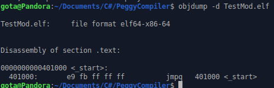
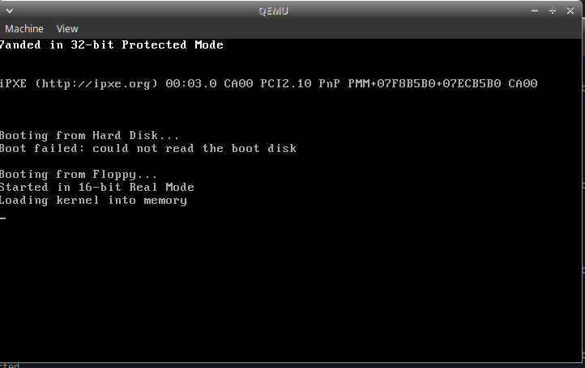

# How To Make A Programming Language
Ever wanted to create your own programming language?

## Table Of Contents
* [Index](Index.md)
* [ANTLR4 Setup](AntlrSetup.md)
* [ANTLR4 Grammar](Grammar.md)
* [Creating Toylet](CreatingToylet.md)
* [Project Setup](ProjectSetup.md)
* [LLVM Crashcourse](Llvm.md) <- You are here.
* [Compiling Toylet](CompilingToylet.md)
* [Epilogue](Epilogue.md)

## Introduction
Hello, this is Gota7, and today I'm going to teach you how to use the LLVM or *Low Level Virtual Machine* API. When working with the LLVM API, we are using a level language like C, C#, etc. to write a low level language called LLVM IR. If you want to see the kind of madness we will be generating, look [here](https://github.com/Virtual-Machine/ir-examples/tree/master/ll). Believe me, I don't understand the syntax either, no one should be subjected to learn it. The reason why is that this is because it is for *computers* to write, not humans. We instead get to write the code that writes that code.

## What Is LLVM
As discussed in the intro, LLVM stands for *Low Level Virtual Machine*. *Ok, but what does that mean?* It means that when we compile code from our custom language, we will be making it into another language called LLVM IR. But this is very powerful. From this form, it can be compiled to any platform LLVM supports, and LLVM has tons of optimizations it can apply to your code without you even planning for some of them. You get all this, for the price of nothing! It does not even have to compile it to native machine code, it could just run bitcode in the same way C# and Java are ran in a virtual machine.

## Some Rules
I hope you understand assembly, as this makes a lot more sense if you know it. But hopefully this overview makes sense. Note that my example code contains no true LLVM IR or building code for this rules section, but this is to illustrate the concepts in an easy to understand way.

### Types
LLVM is very strong with types, and allows you to use many existing or custom ones.

* It allows you to define structures with whatever other structs and data you wish.
* Pointers can be made, and can point to any data.
* Integers can be of any bitwidth, including being 1 bit!
* There is no such thing as strings. A string is just a pointer to a byte array that is null terminated.
* Structures can not contain functions. Code and data are completely different.

### Functions
Luckily you can define quite a bit about functions. Trust me, it's an amazing thing that functions are also abstracted like types, and you don't have to worry about using the correct registers manually.

* Functions can have any number of arguments, have arguments of any type, and have any return type. Variadic functions are also supported too (have an infinite number of parameters of any type).
* There is no such thing as namespaces, functions inside of structs, etc. You have been lied to. All those functions use a mangled name to represent their name depending on their compiler, and functions inside of a structure that are not static take a pointer to the struct as the first parameter. You can not have any function with a duplicate name, even if the arguments are different. What compilers typically do is mangle the parameters for the function to include in the name.
* You can declare `extern` functions, which promises that a function exists somewhere with the given arguments, as long as the appropriate library is linked.

### Control Flow
When inside a function, you have labels you can define and jump around to. Code is executed from top to bottom, unless you encounter an instruction telling you to go to a label. You would think you have if statements or loops or something? No, those don't exist in assembly. You've been lied to, for loops are fake! Ok, if they *don't* exist, how come I can use them? You can actually turn abstractions into top down code fairly easily.

#### If Statements
```cs
if (myNum == 3) {
    myNum += 5;
} else {
    myNum -= 7;
}
```
Can be turned into this:
```cs
goto notEqualTo3 if myNum != 3;
equals3:
myNum = myNum + 5;
goto endIf;
notEqualTo3:
myNum = myNum - 7;
endIf:
```
Hey, you cheated, I see that `if`! But notice that the if makes a single comparison, and then has the program goto another location immediately if the condition is met. In assembly, you need some way to branch to a different place in code if a condition is or isn't met, so we are allowed to this in LLVM IR. Also notice the `goto` at the end of the if block. You don't want the code to execute the code that should happen in `else`, right?

##### Blocks
Notice how we used named labels such as `equals3`? This is what is called a block in LLVM, which basically contains a bunch of code instructions. When you reach the end of a block, you fall into the next block. You can have the program jump to blocks dependent on a condition, or not. When we define code for a function, we will always use what we call the `entry` block at the beginning.

#### Loops
What do you mean loops, don't you mean `for`, `while`, and `loop`? No, I don't. You've been lied to again. They are all the same thing!

##### Generic While True Loop
```cs
while(true) {
    if (condition == true) {
        break;
    }
}
```
Is actually:
```cs
loop:
goto loop if condition != true;
```
Fairly simple, right?

##### While Loops
Same basic idea as a generic loop, just different.
```cs
do {
    number++;
} while (number < 7);
```
```cs
loop:
number = number + 1;
goto loop if number < 7;
```

##### For Loops
They don't do anything special, they are just while loops with more stuff before!
```cs
for (number x = 0; x < 7; x++) {
    // Code.
}
```
Turns into:
```cs
number x = 0;
loop:
x = x + 1;
goto loop if x < 7;
```

### Memory
In LLVM IR, everything is either one of infinitely available virtual registers (think of it as any amount of variables that can store any type of data), or memory allocated from the stack (which you can load and store to). There is no such thing as heap allocation! Those are done by the operating system through library calls like `malloc` and such. So in order to use heap memory, you have to declare `malloc` or the proper function as an `extern` function, and make sure to have the static library linked.

### Variables
Variables in LLVM IR are immutable. Once you declare a variable (all variables use virtual registers) and assign it a value, you can't assign it another value again! But, how can we can do simple code like this:
```cs
number x = 3;
x = 7;
x += 5;
```

#### Global Variables
Global variables have to be initialized with a constant value, but can be changed by loading and storing at the address they are at (like stack variables).

#### Another Register Approach
The first obvious approach is to use separate registers/variables.
```cs
number x = 3;
number x2 = 7;
number x3 = x + 5;
```
This is not only very ugly, but confusing too! We also have to keep track of the latest name!

#### Stack Variable Approach
The best way to solve this problem is to play by the rules, but still kind of cheat. We can allocate stack memory with something called `alloca`. This can allocate a variable from the stack of any type, and returns a pointer to it. I'm going to assume you know how pointers work, which use loading and storing.
```cs
number* x = alloca(number);
*x = 3;
*x = 7;
*x = *x + 5;
```
As you can see, we only used one variable, but yet was able to read and write to it at will!

##### The Catch
What is cool is that LLVM is smart enough to optimize these stack allocations into actual physical registers on your computer when compiling. The bad news is that there is a catch to this of course. Remember the `entry` block at the beginning of every defined function? In order for this optimization to work, we must use `alloca` only within this `entry` block. But then how do we know to allocate memory in the beginning while in something like an if statement? This actually will not be a problem, as we can write to any block at any time when inside the function, and we don't have to give values for the allocated memory, we could just say they should exist.

### What On Earth Are You Talking About?
What, none of this makes sense? It may seem that this has nothing to do with writing code in LLVM, but that couldn't be further from the truth. This section actually taught you how LLVM IR code generation works without showing you a single line of it (or at least the underlining ideas)! Once we get into some actual builder code, you may find it helpful to refer back here for strategies.

## Enough With The Rules, Let's See Some Code!
TODO!!!

## No Dependencies
Want to make your executable standalone? Easy! Just add the `static` flag, so that way the executable does not need any dynamic libraries. My command was: `clang TestMod.bc -o TestMod.elf -static`. Using the Linux `ldd` command on it will show that the executable does not depend on anything as it is not dynamic!

## Multiple Files
TODO!!!

(llvm-link makes program into one BC file, but it isn't needed by clang).

### The Compilation Script
We have LLVM bitcode now, so what? The great news is that the clang compiler can automatically convert this into an executeable! Simply use the command `clang HelloWorld.bc -o HelloWorld.elf` (or exe for Windows), and you should be able to get a program you can run! You can also add the `-static` flag to compile it to not use any external dependencies.

## Bare Metal Example
If you are like me, you may wonder how to use LLVM to develop an operating system, or without any dependencies on a bare metal machine. Since the program we write is to run on a machine with no software other than the BIOS, we can not use any external libraries, including the standard library. Luckily, this is more than possible. One thing you may not know about a program is that `main` is not the main method, `_start` is. This is actually abstracted with the standard library, so we must provide our own `_start` function when compiling for a bare metal target. For this example, I'm going to write an infinite loop as our operating system as a hello world example is more complicated and requires knowledge of operating system development. A fun challenge would be to figure out how to make this program in the LLVM builder yourself, but I'm sure you are tired of quizzes like this from the grammar section, so I'll just give you the code.

```cs
LLVMModuleRef mod = LLVM.ModuleCreateWithName("TestMod");
LLVMBuilderRef builder = LLVM.CreateBuilder();
LLVMValueRef start = LLVM.AddFunction(mod, "_start", LLVM.FunctionType(LLVM.VoidType(), new LLVMTypeRef[] {}, false));
LLVMBasicBlockRef entry = LLVM.AppendBasicBlock(start, "entry");
LLVM.PositionBuilderAtEnd(builder, entry);
LLVMValueRef vga = LLVM.ConstIntToPtr(LLVM.ConstInt(LLVM.Int32Type(), 0xb8000, false), LLVM.PointerType(LLVM.Int8Type(), 0));
LLVM.BuildStore(builder, LLVM.ConstInt(LLVM.Int8Type(), '7', false), vga);
LLVM.BuildRetVoid(builder);
LLVM.WriteBitcodeToFile(mod, "TestMod.bc");
```

Most of it makes sense, just a single `_start` function with its entrypoint and returning nothing. But what is interesting are the lines that create the `vga` variable and the store instruction builder after. On PCs, the VGA buffer (screen) is at position 0xb8000 in memory. Meaning, if we write a `7` to that address, we will write a `7` on the top left of the screen.

### Compiling Bitcode For Bare Metal
When compiling for another target, you use what is called a target triple. Since I am targetting an x86_64 target, my flag is `-target x86_64-pc-none-eabi`. For a full list of target triples, see this page [here](https://llvm.org/doxygen/classllvm_1_1Triple.html). This [page](https://clang.llvm.org/docs/CrossCompilation.html) is also helpful. Since we want this to not depend on any other dependencies for obvious reasons, we need to add the `-static` flag. The final flag is the most important, as it tells the compiler we don't want the standard library (since it doesn't exist for our bare metal platform) `-nostdlib`. My full command is `clang TestMod.bc -o TestMod.elf -target x86_64-pc-none-eabi -nostdlib -static`. You can actually run this ELF file just fine on Linux, it will be an infinite loop that does nothing, but you can do it if you please.



If you look at the code that is actually compiled in the picture above, you can see all it compiles to is a single jump command that causes an infinite loop. In my case, the ELF file is 9,000 bytes, which is a lot of overhead for one little instruction.

### Setting Up The Project
I did find [this](https://github.com/cfenollosa/os-tutorial) mystical guide, which was the holy grail of figuring out how to get our LLVM code running on the bare metal, and I highly recommend it if you want to get into OS development. In the same folder as your `.bc` file, make a folder called `OS`, then place [this](boot.tar.gz) folder in it, which has some code I stole from the guide and slighly tweaked (In the OS folder, there should be a boot folder with a bunch of ASM files).

### Complete Boot Script
Now it is time for the final script. You will need QEMU and nasm installed. This assumes you are in Linux, and you may need to tweak this for you.

```sh
clang TestMod.bc -o TestMod.elf -target x86_64-pc-none-eabi -nostdlib -static
cp TestMod.elf OS/TestMod.elf
cd OS
nasm -f elf64 boot/kernel_entry.asm -o Entry.o
ld Entry.o TestMod.elf -Ttext 0x1000 --oformat binary -o TestMod.bin
nasm -f bin boot/bootsect.asm -o Loader.bin
cat Loader.bin TestMod.bin > BOOT.bin
qemu-system-x86_64 -fda BOOT.bin
cd ..
```

The first line makes an ELF from our bitcode. The 2nd one copies to the OS folder, we then cd to it for convenience. We then assembly a way to call the `_start` function in our ELF. We then link it with our ELF, but export it as binary as we only care about the code inside (and also set the memory address to a constant so we can manage loading it). We then compile the bootsector separately into its own bin file. We then merge the bin files together, and run it with QEMU! If it works, you should see a `7` on the top left of your screen like this:



It's not much, but from there you can theoretically build an entire operating system using your custom language!

## Cross Compilation
When compiling for another target, you use what is called a target triple. For this example, I will be targetting Windows. Since I am targetting an x86_64 target, my flag is `-target x86_64-pc-windows-gnu`. For a full list of target triples, see this page [here](https://llvm.org/doxygen/classllvm_1_1Triple.html). This [page](https://clang.llvm.org/docs/CrossCompilation.html) is also helpful. While I am compiling for Windows on a Linux machine, this should be able to applied to other combinations.

### Install Packages
If you try and run the command `clang TestMod.bc -o TestMod.exe -target x86_64-pc-win32-gnu -fuse-ld=lld`, it will fail! The fuse command is to make sure we are using LLVM's linker instead of the systems. The reason for this failure is that you need actual Windows libraries to link with (as you are targetting Windows). Luckily, this can easily be done with `sudo apt-get install mingw-w64`. Now it will work all of a sudden!

### Without Packages
After installing the libraries with the command above, you probably are wondering how you can compile without requiring a package. To do this, you need to copy two folders and place them next to each other in a convenient location, `/usr/x86_64-w64-mingw32/lib/` and `/lib/gcc/x86_64-w64-mingw32/9.3-win32/`. These have everything you need to generate a Windows executable. I will name the first one the `win` folder, and the 2nd one the `9.3-win32` folder. You should also uninstall the `mingw-64` package and then run `sudo apt-get autoremove` to ensure this setup is standalone. I had my `.bc` file in the same location as these two folders. I than cd'd into the `win` folder and ran this command: `clang ../TestMod.bc -o ../TestMod.exe -target x86_64-pc-win32-gnu -L . -L ../9.3-win32/ -fuse-ld=lld`. For some reason, the clang command is hardcoded to take the directory of the `win` folder as it has hardcoded object paths. The `-L` flag is used to include the current directory, and the `9.3-win32` folder in order to use all the packages that are required.

## Cheating Cross Compilation
What if you wanted to compile to another platform without the hassle? At the moment, I do not know of such a way. And having the user compile or convert anything is really messy, and requires them to have development tools. So if we don't want developers to download massive libraries for cross-compilation or for end users to install anything, what do we do?

### The Other Way
We are currently forgetting the fact that LLVM creates *bitcode* which is only as platform dependent as the functions it uses. Any platform LLVM supports can convert this bitcode to assembly and run it. But wait, we don't want the user to run raw assembly! But LLVM has this tool called *lli* which can run an LLVM bitcode file, much like how Java and C# and ran in a virtual machine: it uses a JIT (Just In Time) compiler to convert LLVM instructions into raw machine code you can execute. So if we were to have this *lli* tool on the target machine, and just give the end user an executable that simply calls it to run our `.bc` file, we are good to go! For more information and targets, check out my github repo [here](https://github.com/Gota7/LLVM-Invoker). This allows us to be able to instantly run our code on any platform without any cross compilation! The only catch is you can only use functions available for the target system.

## Comparison
A comparison summarizing the different methods of compiling a program with LLVM.

### Compilation Modes
This covers whether or not an executable is static or dynamically compiled and linked.

#### Dynamic Compilation (Default)
* Will work on the developer's computer, but may not work on others.
* End user must have all the external libraries the program used installed.
* Is fairly lightweight in distributable size.

#### Static Compilation (-static Flag)
* Will work on other systems regardless of what they have installed.
* Has a larget distributable size.

### Targetting Method
And of course there are different ways to target platforms. This is used in Tandem with the compilation mode.

#### Default (Host)
* Will work on the platform the developer is compiling on, and all other machines of the same platform.
* Requires multiple devices or virtual machines to support other targets.

#### Cross Compilation
* Requires libraries on the developer's machine for each of the destination targets.
* Can be very complicated to set up.

#### LLVM Invoker
* Will work on any target platform that LLVM and the LLVM Invoker support.
* Is very lightweight in distributable size.
* Requires the end user to have LLVM installed in order to run the program.
* Is not guaranteed to run on the end user's computer if unsupported libraries are used.
* Utilizes pre-compiled executables, so there is no compilation to an executable.

#### Bare Metal
* Will always work as long as the bootloader and the compiled assembly language match the target machine's.
* Must take into account different memory addresses for computer hardware for different systems.

## Next
This was a lot of LLVM theory and such, but hopefully you understood the basics and can write some general LLVM generation code. In the next part, we will do the moment we have all been waiting for: compiling Toylet into an executable!
[Compiling Toylet](CompilingToylet.md)