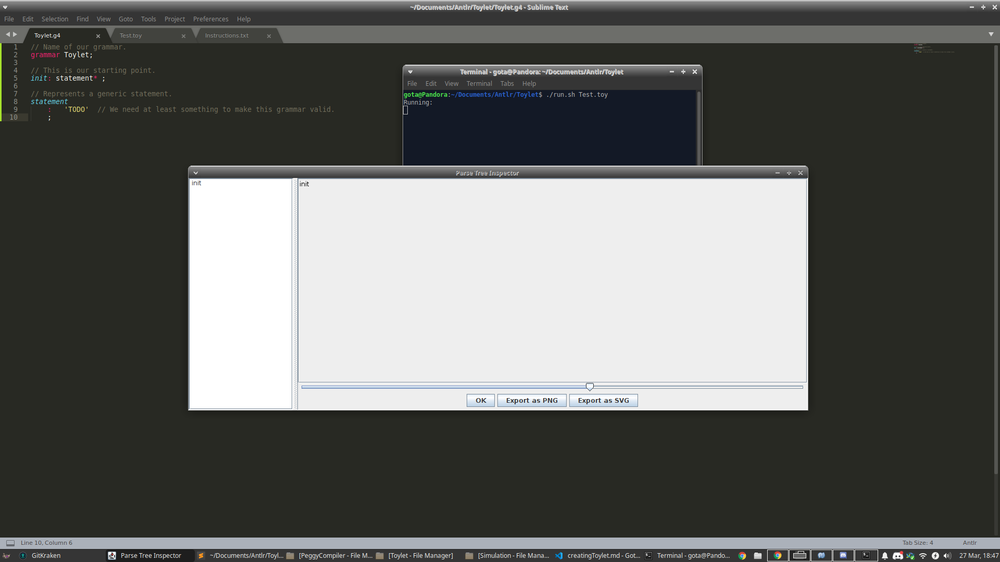
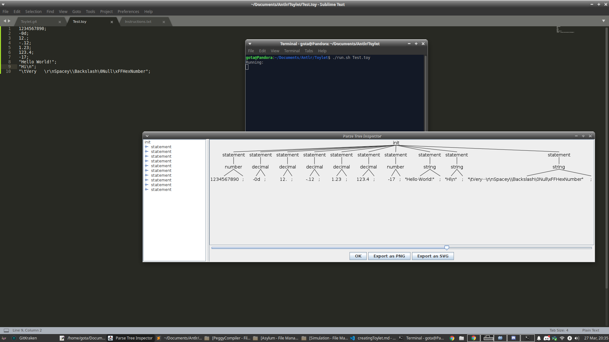

# How To Make A Programming Language
Ever wanted to create your own programming language?

## Table Of Contents
* [Index](index.md)
* [ANTLR4 Setup](antlrSetup.md)
* [ANTLR4 Grammar](grammar.md)
* [Creating Toylet](creatingToylet.md) <- You are here.

## Introduction
Hello, this is Gota7. Before we have been doing some setup and some learning, but now it is time to actually do the work. Well, I sure hope you did the setup and learning in the previous pages. If not, slap yourself in the face and go read them now, not skim them, read and understand them. I'm not going to be making this Toylet language, *you* are. How could you possibly make your own language if you refuse to walk with me, as I show you how you could potentially make it? No way in the world are you going to be able to make a big complex language without some practice on something simpler first, so please follow along. That is also why there is no code you will just be able to copy and paste at the end wahahaha.

## So Uh, How Do We Begin?
Great question! Let's first take a look at some sample Toylet code from earier:
```cs
func doThing(number num, string str, decimal dec) {
    number a = num + 5 * 3 - 1;
    a += (number)dec;
    println(str + a);
}

doThing(3, "Result: ", 5.7);
```
As you can see, there are a lot of moving parts here. But before we can even *think* about implementing anything, we have to get a basic grammar that runs at the very least. Put the following in `Toylet.g4`:
```cs
// Name of our grammar.
grammar Toylet;

// This is our starting point.
init: statement* ;

// Represents a generic statement.
statement
    :   'TODO'  // We need at least something to make this grammar valid.
    ;
```
Now make sure `Test.toy` is blank. Simply run the `run` script with either `Test.toy` as a parameter, or with no parameters and hitting `Ctrl+D` after it starts (normally you enter text you want to test before hitting `Ctrl+D`, but we have none in this case). When ever I say to *run* an input, this is what you will be doing. There will be no more grammar files except for `Toylet.g4`, but you can have as many test `.toy` files as you wish. If you want your folder to be cleared from the garbage ANTLR makes, run the `clean` script. Anyways, you should see this output:



I mean what did you expect? We didn't give it any input, or any true rules. Just the bare minimum required in order to get the language running.

## Baby's First Step
Whitespace is stupid, we don't like it in Toylet. It will interfere with interpretting, and is not needed as we use brackets and semicolons. Your first assignment is to make a `WHITESPACE` Token that uses `-> skip` to skip over whitespace. Can you also figure out how to implement C style `//` and `/* */` comments (`LINE_COMMENT` and `COMMENT` respectively)? Hints: `.` will act like a character in ANTLR that will match anything, you can use operators on it too. You also have to make sure a comment takes precedence over whitespace (as it has a newline in it), remember how to make something match first over another thing? Also note that `\r` is used sometimes, but not always. `~` followed by a character will treat that character as a noninclusive ending point.

### Test Bench
Go ahead and run the below input into your grammar (either by putting it in a `.toy` file to use as a parameter for the run script, or by entering it in manually after doing the run script with no parameters and hitting `Ctrl+D`).
```cs
// Hello World!
/*
	Nothing!
*/
```
If you test some properly formatted comment inputs such as above, you should get absolutely nothing! There should be no warnings or errors if you did it right.

### Solution
<details>
    <summary>WHITESPACE</summary>
    WHITESPACE: (' ' | '\r' | '\n' | '\t') -> skip; // There are probably more characters in the ASCII table, but these are the basic ones.
</details>
<details>
    <summary>LINE_COMMENT</summary>
    LINE_COMMENT: '//' ~('\r' | '\n') -> skip; // This ends a comment when it runs into either a newline or a carriage return.
</details>
<details>
    <summary>COMMENT</summary>
    COMMENT: '/*' .*? '*/' -> skip; // Even simpler than the other comment type, just matches anything between the multiline comment markers. A maybe operator after the any amount operator makes this non-greedy.
</details>
<details>
    <summary>Token Ordering</summary>
    While the order of LINE_COMMENT and COMMENT doesn't matter, they both should be over WHITESPACE. This is so a character belonging to WHITESPACE isn't matched by WHITESPACE before it can get to a COMMENT. All of these should be below the pre-existing Rules of course!
</details>
Now I hope you at least tried to implement them without looking at the solutions first. If you didn't try hard enough, you are cheating yourself. Hopefully you got the hang of stuff by now.

## Numbers, Decimals, And Strings, Oh My!
This is a fun challenge to see what you can do. This one will get incrementally harder. Recall that Toylet only supports 3 data types: signed numbers, decimal numbers, and strings. We need to define the following items:

* A NUMBER Token. This can be any number of digits, and is assumed to be in base 10 (decimal) by default. You can make a NUMBER base 2 (binary) by prefixing it with `0b` or `0B`, or base 16 (hexadecimal) by prefixing it with `0x` or `0X`. There still has to be a number after the prefix. A NUMBER can be negative as well by putting the `-` sign in front of it.
* A DECIMAL Token. You can have any amount of characters before the decimal point `.`, and any amount of characters after. You should not be able to just have the `.` by itself, nor should you be able to just have a number without a decimal point `.` so it would get confused with NUMBER. However, if you put a `d` or `D` after what would be a NUMBER, it will be interpretted as a DECIMAL. You can also make this negative with a `-` sign.
* A STRING Token. Any sequence of characters denoted by being inbetween a pair of `"` is a STRING. You should be able to define escape characters, such that you can insert tabs, newlines, null characters, quotes, backslashes, and even a character denoted by two backslashes, an `x` or `X`, then two hex digits (like `\x3F`).
* For now, remove the `TODO` in the `statement` Rule, and replace that Rule to be that an input can either be a `number`, `decimal`, or `string` (case is and order of them is important, figure out the correct order). Then go define those Rules to be a `NUMBER` followed by a semicolon, a `DECIMAL` followed by a semicolon, and a `STRING` followed by a semicolon respectively.

Hints: Remember that Fragments are your friends here, and you can define as many Fragments as you like. Also be sure to not use any Token definition in another Token definition. It may be helpful to define a Fragment for each of the different number bases, and a Fragments specifically for character escape sequences. Also note that `\\` is how you define a backslash in ANTLR4.

### Test Bench
Keep in mind that you can comment out lines that will not work with your grammar yet! Run the following input:
```cs
1234567890;
-0d;
12.;
-.12;
1.23;
123.4;
-17;
"Hello World!";
"Hi\n";
"\tVery   \r\nSpacey\\Backslash\0Null\xFFHexNumber";
```
You should never have any warnings or errors. Your output tree should look like this:



### Solutions
I'm warning you, you are cheating yourself if you are blatantly copying and pasting these. If you are stuck, go through one solution (do them in order) and see if it helps you solve the other parts. Obviously put the Rules above any Tokens or Fragments, and Tokens over any Fragments.

<details>
    <summary>statement</summary>
    // Simply just call our new decimal, number, and string Rules. You have to make sure decimal is in front of number though, so that way it will detect the d suffix.
    statement
        :   decimal
        |	number
        |	string
        ;
</details>
<details>
    <summary>decimal</summary>
    // Just reference our Token and a semicolon, not much going on here.
    decimal
	    :	DECIMAL ';'
	    ;
</details>
<details>
    <summary>number</summary>
    // Just reference our Token and a semicolon, not much going on here.
    number
	    :	NUMBER ';'
	    ;
</details>
<details>
    <summary>string</summary>
    // Just reference our Token and a semicolon, not much going on here.
    string
	    :	STRING ';'
	    ;
</details>
<details>
    <summary>Fragments For DECIMAL</summary>
    // Just define digits we are allowed to use.
    fragment DecDigit: [0-9];
</details>
<details>
    <summary>More Fragments For NUMBER</summary>
    // Just define some prefixes and other number types a NUMBER could use. Remember that a Fragment can call other ones. Make sure to put the HexDigit above the DecDigit since it uses it.
    fragment HexDigit: DecDigit | [a-f] | [A-F];
    fragment BinDigit: [0-1];
    fragment HexPrefix: '0x' | '0X';
    fragment BinPrefix: '0b' | '0B';
</details>
<details>
    <summary>Fragments For STRING</summary>
    // All the STRING needs is an escape sequence Fragment. Make sure to put this above the Fragments for digit types! Using other Fragments is allowed.
    fragment EscapeSequence
	    :	'\\r'
	    |	'\\n'
	    |	'\\t'
	    |	'\\a'
	    |	'\\b'
	    |	'\\v'
	    |	'\\\\'
	    |	'\\"'
	    |	'\\\''
	    |	'\\\\x' HexDigit HexDigit
	    ;
</details>
<details>
    <summary>NUMBER</summary>
    // You should obviously be defining these tokens above the fragments. This is pretty self-explanatory, just make sure there is at least one digit after the correct prefix, and allow the possibility for negatives.
    NUMBER
	    :	'-'? DecDigit+
	    |	'-'? HexPrefix HexDigit+
	    |	'-'? BinPrefix BinDigit+
	    ;
</details>
<details>
    <summary>DECIMAL</summary>
    // Make sure that a regular number has a suffix after it, and that any possibility can be potentially negative. The way this is defined means there has to be at least one digit before or after the decimal point. Remember that we can only use Fragments and not other Tokens.
    DECIMAL
	    :	'-'? DecDigit+ ('d' | 'D')
	    |	'-'? DecDigit+ '.' DecDigit*
	    |	'-'? DecDigit* '.' DecDigit+
	    ;
</details>
<details>
    <summary>STRING</summary>
    // Match any amount of characters inbetween quotations. Make sure an escape sequence is matched first instead of any item. A maybe operator after the any operator makes this non-greedy.
    STRING
	    :	'"' (EscapeSequence | .)*? '"'
	    ;
</details>

Hopefully you were able to figure out a solution on your own or were close to one of my solutions. If you didn't try, shame on you. Next we will work on variables.

## Variables
TODO!!!