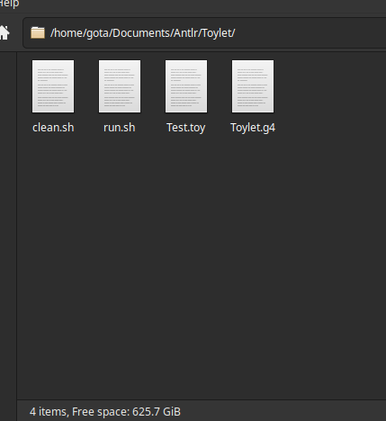

# How To Make A Programming Language
Ever wanted to create your own programming language?

## Table Of Contents
* [Index](index.md)
* [ANTLR4 Setup](antlrSetup.md)
* [Creating The Grammar](grammar.md) <- You are here.

## Setting Up


As you can see here, there are 4 blank files you need (make the sh files excuteable ofc with chmod +x FILE):
* clean.sh (clean.bat for Windows) - ANTLR makes a bunch of junk files so this is useful to remove them all. Just make sure you run this while in the same folder.
* run.sh (run.bat for Windows) - This will compile your grammar and let you test it with either a given file path, or typing into the terminal directly.
* Test.toy - Sample code file for testing, you can have as many code files as you need for testing.
* Toylet.g4 - This will contain our grammar, and is what we are trying to complete!

## Cleaning Script
Linux:
```
rm *.class
rm *.interp
rm *.java
rm *.tokens
```
Windows:
```
del *.class
del *.interp
del *.java
del *.tokens
```

Not much to say about this one, it just removes all the java compiled stuff.

## Running Script
```
antlr4 Toylet.g4
javac *.java
echo Running:
grun Toylet init -gui $1
```
Replace `$1` with `%~1` to get this to work on Windows. For this command, you may need to replace `antlr4` and `grun` with the complete counterparts on the previous page, as I had to do. Anyways, the first command converts your grammar to java files, the second one compiles it, the third one tells you the test program is running, and the last one runs through the Toylet grammar starting at the `init` rule with the GUI enabled. If you run the script with a file path as an argument, it will try to apply your grammar to that file, else it will let you type in whatever you want in the terminal to have it end with `Ctrl+D`.

## Test File
`Test.toy` will be blank for now, but will have more and more code as we develop our language more.

## Grammar File
`Toylet.g4` is to contain our grammar code, and what we will begin working on! But first, let's talk about some basic ANTLR syntax.

## Crash Course ANTLR
TODO!!!