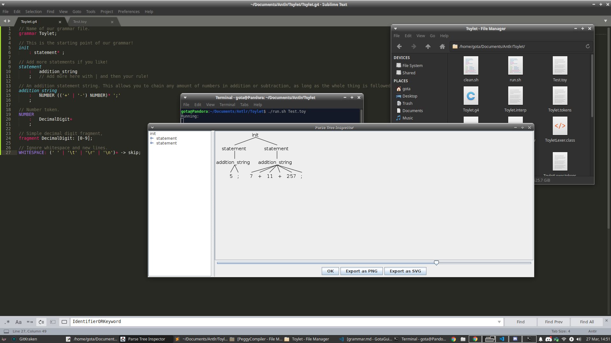

# How To Make A Programming Language
Ever wanted to create your own programming language?

## Table Of Contents
* [Index](index.md)
* [ANTLR4 Setup](antlrSetup.md)
* [ANTLR4 Grammar](grammar.md) <- You are here.

## Setting Up


As you can see here, there are 4 blank files you need (make the sh files excuteable ofc with chmod +x FILE):
* clean.sh (clean.bat for Windows) - ANTLR makes a bunch of junk files so this is useful to remove them all. Just make sure you run this while in the same folder.
* run.sh (run.bat for Windows) - This will compile your grammar and let you test it with either a given file path, or typing into the terminal directly.
* Test.toy - Sample code file for testing, you can have as many code files as you need for testing.
* Toylet.g4 - This will contain our grammar, and is what we are trying to complete!

## Cleaning Script
Linux:
```sh
rm *.class
rm *.interp
rm *.java
rm *.tokens
```
Windows:
```bat
del *.class
del *.interp
del *.java
del *.tokens
```

Not much to say about this one, it just removes all the java compiled stuff.

## Running Script
```sh
antlr4 Toylet.g4
javac *.java
echo Running:
grun Toylet init -gui $1
```
Replace `$1` with `%~1` to get this to work on Windows. For this command, you may need to replace `antlr4` and `grun` with the complete counterparts on the previous page, as I had to do. Anyways, the first command converts your grammar to java files, the second one compiles it, the third one tells you the test program is running, and the last one runs through the Toylet grammar starting at the `init` Rule with the GUI enabled. If you run the script with a file path as an argument, it will try to apply your grammar to that file, else it will let you type in whatever you want in the terminal to have it end with `Ctrl+D`.

## Test File
`Test.toy` will be blank for now, but will have more and more code as we develop our language more.

## Grammar File
`Toylet.g4` is to contain our grammar code, and what we will begin working on! But first, let's talk about some basic ANTLR syntax.

## Crash Course ANTLR
Now it is time to go over the basic syntax of ANTLR4. Of course, there is a lot more you can do if you know some specifics of ANTLR, such as putting content on different channels or executing arbitrary code, but I will just go over the basics for now.

### Declaring A Grammar
You use the `grammar` keyword at the very top of the file to declare a grammar file, it should match the .g4's file name! Also notice that comments are allowed. ANTLR4 supports the traditional `//` and `/* */` C style comments.
```cs
// Name of our grammar.
grammar Toylet;
```
Only do this once per file at the beginning, and that's about it!

### Syntax Rules
ANTLR has 3 different types of structures that define the Rules for your language: Fragments, Tokens, and Rules. But first, we need to break down a simple if statement to understand how they play into a language.

#### Tokens
Consider the following C# code:
```cs
if (myVar == 45) {
    otherVar *= 1.23;
    doThing(otherVar);
}
```

The easiest thing to consider are the Tokens present. Tokens are the individual characters and groups of characters that form a part of the syntax. Ignoring whitespace, for the first line of code the Tokens are `if`, `(`, `myVar`, `==`, `45`, `)`, and `{` in that exact order. Notice that a Token is not always a single character. It makes much more sense when you see it right? Now it's your turn! See if you can guess the Tokens in the 2nd, 3rd, and 4th lines!
<details>
    <summary>2nd Line</summary>
    `otherVar`, `*=`, `1.23`, and ';'
</details>
<details>
    <summary>3rd Line</summary>
    `doThing`, `(`, `otherVar`, `)`, and `;`
</details>
<details>
    <summary>4th Line</summary>
    `}`
</details>
Not too complicated I would imagine.

#### Fragments
Now you may have noticed that some Tokens are hard to define. While you could easily define Tokens such as `;`, `if`, or even `*=`, it is impossible to create every number or variable name imaginable. How could you define something such as `myVar1`, or `2.34`? Fragments are **varying** individual characters that make up a Token. For the number `2.34`, the Fragments would be `2`, `.`, `3`, and `4`. Since `2.34` is a number, and `myVar1` is a name and it is impossible to define every single combinations of them, they contain Fragments. However, items like `if` is a keyword, and it is possible to define Tokens for every possible keyword, so it therefore has no Fragments. Now what would the Fragments be in `for`? Trick question! There are no Fragments, `for` is a keyword and is therefore a single Token! Now it's your turn to figure out the individual Fragments!
<details>
    <summary>`45`</summary>
    `45` is a number, and it is impossible to define every possible number when defining a Token explicitly. This means it has the Fragments `4` and `5`.
</details>
<details>
    <summary>`==`</summary>
    `==` is a comparison operator, and it possible to define a Token explicitly for every possible comparison operator. This means it has no Fragments.
</details>
<details>
    <summary>`myFunction`</summary>
    `myFunction` is a name of a function, and it is impossible to define explicitly a Token for every possible function name. This means all the Fragments are the individual characters in the name.
</details>
A little more confusing, but hopefully you got the hang of it! Note that we will later define Tokens in terms of either hardcoded characters or Fragments.

#### Rules
Let us revisit the C# code example:
```cs
if (myVar == 45) {
    otherVar *= 1.23;
    doThing(otherVar);
}
```
Rules are declared in terms of Tokens (never Fragments), and are the most complicated part. They usually depend on other Rules to define. For example, let us look at the `if` statement in its entirety. We always start with an `if` Token, then a `(`, next another Rule that will result in a boolean value, followed by a `)`, then either a single code statement, or code nested inside of `{` and `}`. Notice that there are conditions in this alone. We could define our Rule as `if (conditionalExpression)` followed by either `codeStatement` or `{ anyNumberOfCodeStatements }`. In the example above, we know it is the 2nd outcome as there are curly brackets with multiple code statements inside. We will not bother to define a `conditionalExpression` or `codeStatement` Rule yet, as they can become fairly complicated for this example. For now, try and see if you can define a Rule for each of the two lines of code inside the if statement in terms of Tokens or names of other Rules. Make sure to label each part as either a Token or Rule.
<details>
    <summary>1st Line</summary>
    `variableName TOKEN` `assignmentOperator RULE` `valueExpression RULE` `; TOKEN` I know this seems like cheating, since there are only two Tokens (variable name and semicolon), but a lot of programming is indeed abstract. I know you could write variables a Rule since you could do `name.item`, but for now let's assume variable names are Tokens. Assignment Operator is a Rule since `*=` is a Token, but all the operators would make up a Rule.
</details>
<details>
    <summary>2nd Line</summary>
    `functionName TOKEN` `( TOKEN` any amount of `variableName TOKEN`s or `valueExpression RULE`s separated by a `, TOKEN` `) TOKEN` `; TOKEN` Did you remember that you can have multiple parameters in a function call or even none? Notice that a Value Expression Rule will cover instances where a variable name is combined with an expression (such as adding 1 or another variable to it).
</details>
<details>
    <summary>AssignmentOperator Rule</summary>
    `+=` or `-=` or `*=` or `/=` or `%=` or `&=` or `|=` or `^=`... You get the idea. Notice how all Rules will break down into Tokens at some point.
</details>
I know it can be really hard to break down parts of language into abstract grammar, as it is impossible to know every single outcome when first defining a Rule. Therefore, when we start declaring our actual Toylet grammar, we will try and build it one step at a time, even if a step is not completely correct and is simplified for the sake of testing.

### ANTLR Symbols
It's time we learn some ANTLR operators.

#### Basic Syntax
Something is declared in ANTLR in the form `NAME: DEFINITION;` where `NAME` is the name of the item being declared, and `DEFINITION` is its definition. Fragments are given CamelCaseNames, Tokens are given ALL_CAPS_NAMES, and Rules are given lowercase_names. It is common to write out a definition in this form:
```cs
NAME
    :   DEFINITION
    ;
```
This may seem strange now, but you will see why this is very common when dealing with the or operator.

#### And
Any two items next to each other imply needing both at the same time in order to match. Consider the following Rule, assuming the Token `NUMBER` is defined, where `NUMBER` represents any valid decimal number:
```cs
    my_rule
    :   NUMBER '+' NUMBER
    ;
```
This will only match items such as `3 + 0` or `3434 + 98`. It will not match anything such as `myVar + 2` or `8 +`. It requires every single part to be present in order to match.

#### Or (|)
Consider the following Rule, assuming the Token `NUMBER` is defined, where `NUMBER` represents any valid decimal number:
```cs
my_rule
    :   NUMBER '+' NUMBER
    |   NUMBER '-' NUMBER
    ;
```
This Rule will match something such as `4 + 3` or `12 - 0`, since the `|` (or) operator is used to define the different combinations. It will not match `myVar + 7` or `3 * 9`. You don't *have* to have a newline, but this looks a lot easier to understand then:
```cs
my_rule
    :   NUMBER '+' NUMBER | NUMBER '-' NUMBER;
```
Ew, the top one is definitely a lot easier to understand!

#### Maybe (?)
I don't know the formal name for this one, but I'm going to call it the maybe operator. It will match something if it is there, but it won't bother if it is not present. Consider the following Rule, assuming the Token `NUMBER` is defined, where `NUMBER` represents any valid decimal number:
```cs
my_rule
    :   NUMBER '+' NUMBER?
    ;
```
This Rule will match either `7 + 51` or `343 +`. It does not care if the last number is present or not.

#### Parenthesis
Sometimes the order of operators is not in your favor, but luckily, you can use parenthesis to fix that! Consider the following Rule, assuming the Token `NUMBER` is defined, where `NUMBER` represents any valid decimal number:
```cs
my_rule
    :   NUMBER ('+' | '-')? NUMBER
    ;
```
Now this is a more complicated expression, but you can figure out what it means fairly easily. It means the `+` and `-` Tokens are optional, and it could be either one of them. This Rule will match examples such as `3 + 4` or `123 - 456` or `0 91`. What if we were to remove the parenthesis?
```cs
my_rule
    :   NUMBER '+' | '-'? NUMBER
    ;
```
Now the Rule is completely different! It will either match a number followed by a `+` Token, or a number with an optional `-` Token preceding it. It would match examples such as `1 +`, `- 456`, or `21`. Big difference!

#### At Least (+)
What if you wanted to define you want *at least* an instance of something? While with this operator, you can! Consider the following Rule, assuming the Token `NUMBER` is defined, where `NUMBER` represents any valid decimal number:
```js
my_rule
    :   NUMBER (('+' | '-') NUMBER)+
    ;
```
Now this example has a lot of moving parts, but the beauty and usage of this is incredible! Now we can chain any amount of additions and subtractions with decimal numbers. For example, these examples will be matched: `3 + 99 - 12 + 456`, `3 - 11`, `930 - 12 + 4`. Notice that `3` will not be matched, as at least one addition or subtraction is needed by the Rule. But what if we want it to be legal? Luckily, there is an operator just for that!

#### Any Amount (*)
This operator allows you to have a certain sequence repeat any amount of times. With this, we can make a Rule that can match any expression given with decimal characters and addition and subtraction, assuming you can not use parenthesis in the input sequence to parse. Consider the following Rule, assuming the Token `NUMBER` is defined, where `NUMBER` represents any valid decimal number:
```js
my_rule
    :   NUMBER (('+' | '-') NUMBER)*
    ;
```
Notice how it is equivalent to the previous Rule, except for the fact that we now use the any `*` operator instead of `+`. This not only allows us to match any sequence the previous Rule does, but to also match single numbers such as `3` or `27`. Now the Rule can handle a chain of additions and subtractions of any length!

#### Range ([])
When you are defining Fragments, you will want to be able to define a range of characters. The following example shows how you can define a Fragment for a hexadecimal digit:
```js
fragment HexDigit
    :   [0-9]
    |   [a-f]
    |   [A-F]
    ;
```
Notice how you can define a range in the brackets. `[a-f]` is the same as saying `[abcdef]`, the range is inclusive as you see. Make sure the characters are consecutive in an ASCII table when declaring a range. As you can imagine, this will match single characters such as `a`, `E`, and `7`. If you have the input `3f`, it will match as two separate `HexDigit`s.

### Declaring Fragments In ANTLR4
As you have learned above, Fragments make up Tokens that can not be defined explicitly (if it is impossible to type out every possible combination, a Token has Fragments). Fragments can also use other Fragments, but you can not use Fragments in a Rule. We will define a Frament in this form:
```cs
fragment CamelCaseName: DEFINITION;
```
Of course we will replace `DEFINITION` with the actual way of defining a Fragment. You saw the example of the Hex Digit above, but here is one that would match a letter:
```js
fragment Letter
    :   [a-z]
    |   [A-Z]
    ;
```
Fairly simple, right?

### Declaring Tokens In ANTLR4
Tokens are either defined explicitly or given in terms of Fragments. You define a Token in this form, with the name being in all caps:
```cs
TOKEN_NAME: DEFINITION;
```
Of course we will replace `DEFINITION` with the actual way of defining a Token. Let us create a Token for a floating point data type, assuming we have a Fragment called `DecimalDigit` that will match any character from `0 to 9` inclusively:
```cs
FLOAT
    :   DecimalDigit+ '.' DecimalDigit*
    |   '.' DecimalDigit+
    ;
```
Now you are probably wondering, why can't we just have `DecimalDigit* '.' DecimalDigit*`? The answer to that is simple: it would allow us to match `.` which is definitely not a floating point number. With the way this is defined, you are forced to have a number before or after the decimal point. But why isn't there a way to match without the decimal point? The reason is that we will probably define a `NUMBER` Token that allows any number. And so if you could just define a `NUMBER` the same way you could define a `FLOAT`, how would the parser know which one to choose? It wouldn't, which is why you can't do that! You could also define simple things such as keywords or operators with Tokens:
```cs
OPERATOR_ASSIGN_MUL
    :   '*='
    ;
```
Simple right? Now, you are probably thinking that we should not define every operator separately, and instead just define a single `ASSIGNMENT_OPERATOR` Token. The problem with that logic is that an assignment operator in general is a Rule, not a Token. `+=` is a Token, but `+=` or `-=` is a Rule, since every possible assignment operator is not a Token. This may seem a bit hard to follow, but keeping this reasoning will prevent you from weird ANTLR bugs in the future, I'm speaking from experience. The rule of thumb is that you may define Tokens in terms of Fragments and raw characters like `'a$3'`, but do NOT define Tokens in terms of other Tokens!

### Declaring Rules In ANTLR
Now this is the real meat of your parser. Fragments and Tokens may make up all the individual segments of your language, but Rules are how you define what is legal and illegal syntax. Here is how you define a Rule, with the name in all lowercase:
```cs
rule: DEFINITION;
```
Of course we will replace `DEFINITION` with the actual way of defining a Token. Rules can call themselves recursively too. Here is how you may define the order of operations with PEMDAS, assuming that the used Tokens are defined:
```cs
expression
    :   '(' expression ')'
    |   expression OPERATOR_MUL expression
    |   expression OPERATOR_DIV expression
    |   expression OPERATOR_ADD expression
    |   expression OPERATOR_SUB expression
    |   NUMBER
    ;
```
Noticed that this is defined from top to bottom in order to PEMDAS (excluding exponents). If multiple possible outcomes are taken like in `3 + 1 * 8 / (3 - 4)`, it will first do the expression in parenthesis, then the multiply operations, then the divide operations, then the addition operations, and the subtraction operations. This is done recursively, so the order of operations is preserved!

### ANTLR Structure
Structuring in an ANTLR grammar file is a bit backwards, but it makes sense. Think of it as a pyramid. If a Rule depends on another Rule, try to put the Rule that uses the other Rule on top if possible. This means Fragments should be on the bottom, Tokens in the middle, and Rules on top. If you fail to go by this structure, you can run into some strange errors.

### Making A Simple Test
Now I am sure all this talk about ANTLR has gotten you salivating on how to try it out for yourself. Luckily with the setup earlier in this page, you have the hard part done already! For our simple test, put the following code in your `Toylet.g4` file:
```cs
// Name of our grammar file.
grammar Toylet;

// This is the starting point of our grammar!
init
    : statement* ;

// Add more statements if you like!
statement
    :   addition_string
    ;   // Add more here with | and then your Rule!

// An addition statement string. This allows you to chain any amount of numbers in addition or subtraction, as long as the whole thing is followed by a semicolon.
addition_string
    :   NUMBER (('+' | '-') NUMBER)* ';'
    ;

// Number Token.
NUMBER
    :   DecimalDigit+
    ;

// Simple decimal digit Fragment,
fragment DecimalDigit: [0-9];

// Ignore whitespace and new lines.
WHITESPACE: (' ' | '\t' | '\r' | '\n')+ -> skip;
```
Now either write this in your `Test.toy` file when running the `run` script with `Test.toy` as an argument, or when typing in a terminal when running the `run` script with no arguments and hitting `Ctrl+D` when you are finished entering it:
```
5;
7 + 11 + 257;
```
You should see something like this:

Play around! You can click on entries on the left of the tree view to see individual parts of the program. Click `OK` once you are done. This tree will also be useful for showing errors as well.

### Avoiding Pitfalls In ANTLR
Sometimes things in ANTLR will not work out how you expect them too. Please try and take care of any warnings you see in the terminal, as they can cause potential problems in parsing your language. Here, I will try and go over a few mistakes that can cause them.

#### Is The ANTLR Syntax Legal?
Make sure to only use one `:` when defining something and making sure to use a single ending `;` at the end of your definition! Failing to do so will cause weird errors. Assume the Token `NUMBER` is defined and represents any valid decimal number:
```cs
my_rule:
    :   NUMBER
```
This is invalid ANTLR!

#### Is Something Ambigious?
Sometimes there will be some ambiguity as shown in the example above with operator prescedence. But whenever you have two different Rules that match the same thing, or a Rule that has the ability to match nothing, that is a problem. Assume with have the Fragment `DecDigit` defined, which represents any valid decimal digit:
```cs
NUMBER
    :   DecDigit*
    ;
```
This is bad! It allows us to define a blank input, which we don't want. The following is also bad:
```cs
NUMBER
    :   DecDigit DecDigit*
    |   DecDigit+
    ;
```
The two lines do the exact same thing! Now say we have three Rules that make sure of a properly defined `NUMBER` Token:
```js
statement
    :   my_rule_1
    |   my_rule_2
    ;

my_rule_1
    :   NUMBER (('+' | '-') NUMBER)*
    ;

my_rule_2
    :   NUMBER ('-' NUMBER)+
    ;
```
This is bad, since if we try to parse `32 - 5` using the `statement` Rule, it will not know whether or not to use `my_rule_1`, or `my_rule_2`. This could lead to situations you do not want.

#### Improper Usage Of Definitions
If you are defining Tokens in terms of other defined Tokens, or using Fragments in Rules, you should not be doing that and may be causing a weird error.

#### Improper Pyramid Structure
Recall the section about ANTLR's structure. You want dependencies of definitions below the defintions when possible. This means Fragments on the bottom, Tokens in the middle, and Rules on the top. A Rule that uses another Rule is higher than the Rule being used, the same goes for Fragments. This should not be a situation with Tokens, since you should not be defining Tokens with other Tokens in the first place.

## Next
That was a lot of information to take in! But hopefully you should understand how to use ANTLR enough to try it out on your own. Remember, "What I cannot create, I do not understand" - Richard Feynman. In the next section, we will start building the syntax for our Toylet language!
[Creating Toylet](creatingToylet.md)